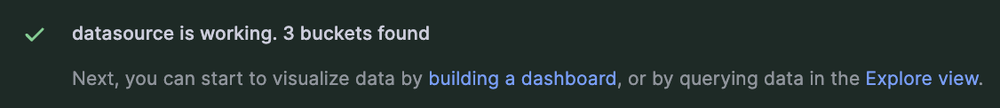

# SysMetrics Monitor
SysMetrics Monitor is a real-time monitoring tool that captures and visualizes system-level metrics, including CPU, memory, disk, and network utilization. Designed for system administrators and DevOps professionals, it provides insights into infrastructure performance and health, leveraging the power of Telegraf, InfluxDB, and Grafana.

## Key Features:
- **Real-Time Monitoring**: Continuously track the health and performance of your system's CPU, memory, disk, and network.
- **Historical Data Analysis**: Leverage InfluxDB's efficient time-series data storage to analyze past performance and identify trends.
- **Customizable Dashboards**: With Grafana, create and customize dashboards to focus on the metrics that matter most to you.

## Prerequisites

Before you begin, ensure you have met the following requirements:
* You have installed the latest version of [Docker](https://docs.docker.com/get-docker/) and [Docker Compose](https://docs.docker.com/compose/install/).
* You have a `<Windows/Linux/Mac>` machine.


## Cloning the Repository

To clone the repository and run the application, follow these steps:

```bash
# Clone the repository
git clone https://github.com/nicolemah99/sys-metrics-monitor.git

# Navigate to the repository directory
cd sys-metrics-monitor
```
## Configuration
1. Rename the `.env.example` file to `.env`
2. Fill in the environment variables in the `.env` file with your desired configurations.

## Running the Application
Start SysMetrics Monitor using Docker Compose. This will run in detached mode, remove the `-d` to run in your terminal.
```bash
docker-compose up -d
```

## Accessing the Application
SysMetrics Monitor components are accessible at the following URLs:

- **InfluxDB**: http://localhost:8086 - for database management.
- **Grafana**: http://localhost:3000 - for data visualization and monitoring dashboards.
## Initial Setup
### InfluxDB
Once InfluxDB is running:
1. Navigate to http://localhost:8086 and complete the initial setup
2. Create an initial user, password, organization, and bucket.
    - Use the values from the environment variables in the `.env` file
3. Place the token that is generated into the `INFLUX_TOKEN` environment variable in the `.env` file

### Connecting InfluxDB to Grafana
1. Access Grafana at http://localhost:3000
2. Log in with the default login:
```bash
username: admin
password: admin
```
3. You will be prompted to change the password, you can skip this, but if you choose to change the password you must update `GRAFANA_USER` and `GRAFANA_PASSWORD` in the `.env` file
4. Click on **Add your first data source**
5. Choose InfluxDB and add the following:
    - **Query language**: Flux
    - **URL**: `http://influxdb:8086`
    - **Organization**: `INFLUX_ORG` from `.env`
    - **Token**: `INFLUX_TOKEN` from `.env`
    - **Default Bucket**: `INFLUX_BUCKET` from `.env`
6. Click **Save & test** 
    - You should see a a green success box if the data source is properly configured


7. Restart containers to apply the changes:
```bash
docker-compose restart
```

## You're ready to create your first Dashboard
1. Go back to the Grafana home page
2. Click **Create your first dashboard**
3. **Add visualization**, choose **influxdb**.
4. You can now write [Flux Queries](https://docs.influxdata.com/influxdb/latest/query-data/get-started/)
5. Verify Data is connected by running the following queries:
```bash

```

## Tips
1. Use Influxdb's *Data Explorer's* and *Scipript Editor* and *Query Builder* to create your desired Flux queries to use in your Grafana dashboard.
2. Use the following **Flux** query to ensure you have data:

This query lists the first 10 records from a your bucket, but sure to replace `INFLUX_BUCKET` with the name of your influx bucket.
```
from(bucket: "INFLUX_BUCKET")
  |> range(start: -1h)  
  |> limit(n: 10)
```
